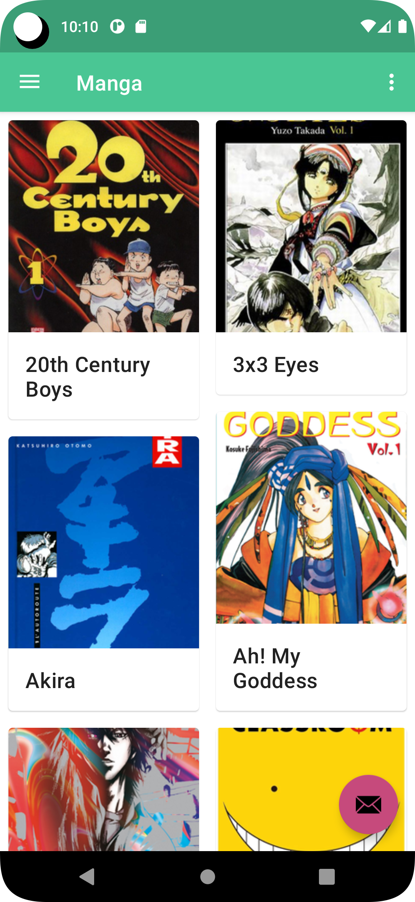

# android-yome

This app is an android native reader for [Kavita](https://www.kavitareader.com/)

-----

This project is very open to pull request. Please fork this project and open pull requests.
Try to do small and readable PRs, and don't forget to comment your code even if you think that is useless.

This has been developped with Android Studio and uses different technologies like Kotlin, Hilt, Retrofit2, Angular Material, ...

-----

The name of the app is japanese and means "Read!".
It's also a book from [Hamada](https://fr.wikipedia.org/wiki/Masatoshi_Hamada) who is one of my favourite japanese comedian.
